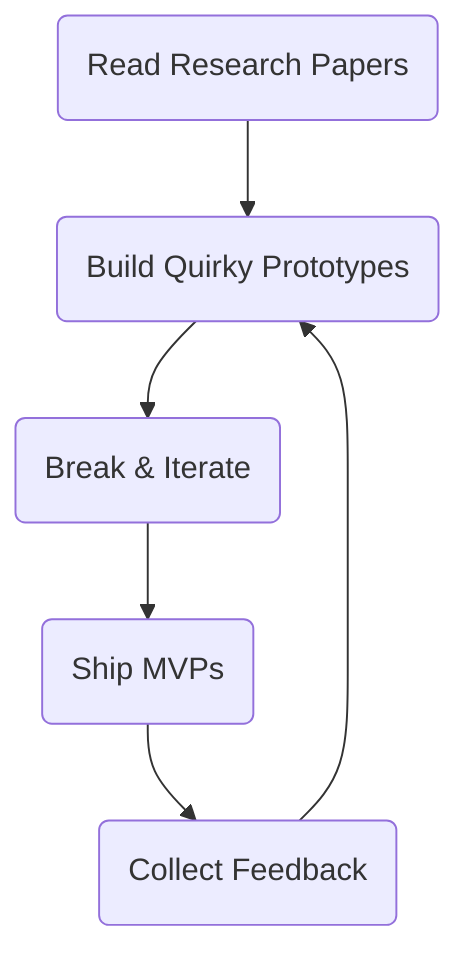

<!-- Vishnupriyan P R's GitHub Profile README -->

<h1 align="center">Hey, I'm Vishnupriyan P R 👋</h1>

  

  
  

---

## 🚀 Projects I’m Building

- **Verve** – AI-powered mobile assistant helping chronic-illness warriors manage meds & vitals.  
  `Flutter · FastAPI · Transformers · LangChain`

- **University Placement Insights** – Dashboard turning placement data into clear insights for students & TPOs.  
  `Streamlit · pandas · Plotly`

- **OXOCARE (🏆 Hackathon Winner)** – OCR-first vault that secures & summarizes medical records with AI.  
  `OpenCV · Tesseract · LangChain · AES-256 · Flask`

- **Cardiac‑Care** – Heart‑health suite featuring ECG ML, triage chatbot, and real‑time alerts.  
  `React · Flask · TensorFlow · Twilio`

- **AI Medical Report Summarizer** – Upload PDFs/images → receive concise AI‑generated summaries.  
  `OCR · HuggingFace · Flask · BERT`

---

## 🧠 Skill Fusion

| Area            | Tools & Frameworks                              | Superpowers                          |
| --------------- | ----------------------------------------------- | ------------------------------------ |
| **AI / ML**     | PyTorch · TensorFlow · HuggingFace · LangChain  | Real‑time inference, AI agents       |
| **Backend**     | Flask · FastAPI · PostgreSQL · Redis · GraphQL  | Secure, scalable APIs                |
| **Frontend**    | React · Next.js · Flutter · Tailwind            | Pixel‑perfect, accessible UIs        |
| **Data / Viz**  | pandas · Plotly · Streamlit · Superset          | Story‑driven visual dashboards       |
| **DevOps**      | Docker · GitHub Actions · Vercel · GCP          | Fast CI/CD & zero‑downtime deploys   |

---

## 🌱 Growth Loop

---

## 🎮 Gamer Mode

*Games are my logic lab. I mod engines, reverse algorithms, and sometimes build bots that beat me at my own game.*

---

## 🚗 Under‑the‑Hood Corner

- Tuning ECU maps with data logs  
- FFT‑based exhaust note analysis  
- Dream build: AWD EV swap + ML traction control  
- Bridging software logic with mechanical motion

---

## 📈 GitHub Stats

  
  

  
  

  

  
  

---

## 🤝 Connect With Me

  
  
  
  

  
  

---

## 💡 Philosophy

> **Stay Curious · Stay Chill · Stay Relentless**

I build code that matters, explore ideas fearlessly, and aim to leave tech a bit more futuristic than I found it.

---

<!-- Banner placeholder -->
<!--  -->

  

  
  

